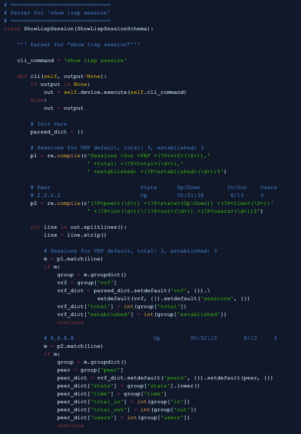
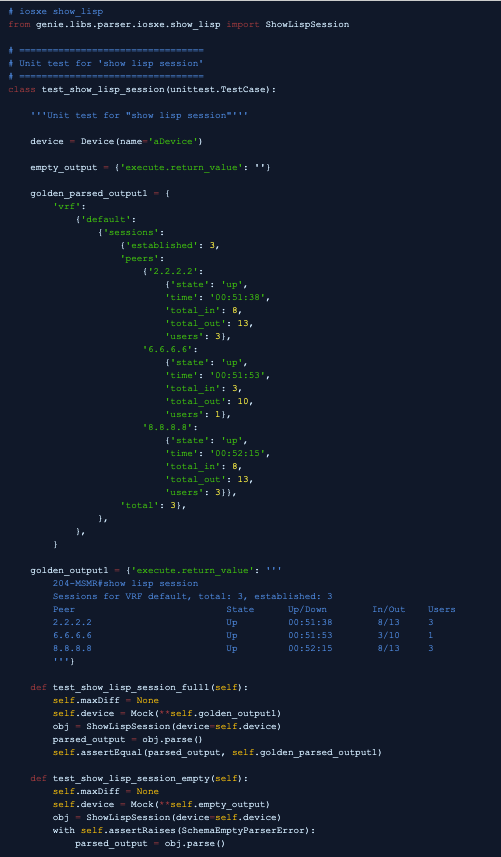

# Genie Parsers Coding Guidelines

*Share-ability, Object Oriented Programming, Re-usability.*

Genie promotes the idea of reusability and that's why we've come up with the
guidelines below to create standarized, shareable and reusable libraries that
everyone can understand and benefit from.


# Documentation

Documentation is part of the development. All code must be commented to help the
reader. All new parsers and parser utilities should contain extensive comments 
highlighting which show commands are parsed, etc. More details can be found in 
the Genie Parser Coding Guidelines below.


# Genie MetaParser & Genie Libs Parsers

There are multiple ways to communicate with a device using different 
communication protocols such as CLI, XML, NETCONF, REST etc. Each communication 
protocol returns the same device information; however it requires a different 
input and in turn provides a different structure for each protocol.

Parsing is the mechanism of translating and harmonizing device output into usable
Python data structures that can be understood by a script. Parsers are therefore 
the backbone of automation. Without parsers, automation cannot understand and 
communicate with a device. Regular Expressions (sometimes shortened to regexp, 
regex, or re) are a tool for matching patterns in text. Regular expressions are 
the core component of all parsers.

Genie has two packages that are dedicated to the task of parsing 
(pattern matching) device output data (text). The Genie Metaparser package and 
Genie Libs Parsers package collectively enable users to homogenize parsed data 
into a single structure/schema across multiple communication protocols. 

These packages are:

1. genie.metaparser: 
Metaparser is the core infrastructure of Genie parsers and is used to standardize 
parsing any format of device data (CLI output, XML output, NETCONF/Yang output).
It is responsible for ensuring that a parser returns a fixed data-structure 
known as the parser's schema.

2. genie.libs.parser:
This package contains Python classes that breakdown raw Cisco device data 
(CLI output, XML output, etc.) by parsing the data using regular expressions 
into software-readable Python data-structures (dictionary) that match a defined 
schema. One parser class can be used to parse CLI output, XML output or NETCONF 
output of a device command. However, the parser for each output must return the 
same Python data-structure defined in the schema.


# Available Parsers

Before writing a parser make sure to [check existing parsers] to see if one 
already exists for your correspoding OS. If it doesn't match your requirements
entirely, consider extending the existing functionality to accomodate your
requirements. Think broader than just your parser, let's make it useful for 
everybody!

[check existing parsers]: https://pubhub.devnetcloud.com/media/pyats-packages/docs/genie/genie_libs/#/parsers


# Writing New Parsers

Writing a complete genie parser consists of three steps:

1. Creating a Schema Class
2. Developing a Parser Class
3. Implementing & executing unittests

## Creating a Schema Class

This class contains the Python data-structure/dictionary known as the "schema". 
This schema will contain key value pairs of data parsed from device output. 
Refer to the example below for a sample schema for show command "show lisp session".
Note that the keys that are not always expected to be found in device output are 
marked as "Optional". All other keys have a specific name (key) and value type 
(integer, string, boolean, list etc.)


## Developing a Parser Class

This class contains the regular expressions that can parse each line of the 
device output into the Python dictionary defined in the Parser Schema Class. 
The Parser Class inherits from the Parser Schema Class to ensure that the Python 
dictionary returned by the class is exactly in the format of the defined schema.
Refer to the example below for a Parser Class that returns the Python dictionary 
defined in the Parser Schema Class (above)



## Implementing and executing unittests

Each parser developed within Genie in the genie.libs.parser package must be 
accompanied by a unittest. A parser unittest is created by using Mock to return 
device output as though it was returned by a real device. The device output 
should then be parsed by the Parser Class and return a Python dictionary 
containing parsed data.



# Coding Guidelines

All parsers headers must follow the following [Google Style] coding guidelines.

[Google Style]: http://sphinxcontrib-napoleon.readthedocs.io/en/latest/example_google.html

__Header example__
```
''' Some text explaining what this parser module is about

IOSXR Parsers for:
    * 'show something'

'''

#
# List your imports at the top
#

# Python
import re

# Metaparser
from genie.metaparser import MetaParser
from genie.metaparser.util.schemaengine import Any, Or, Optional


# ====================
# Schema for:
#   * 'show something'
# ====================
class ShowSomethingSchema(MetaParser):

    ''' Schema for:
        * 'show something'
    '''
  
    schema = {}


# ====================
# Parser for:
#   * 'show something'
# ====================
class ShowSomething(ShowSomethingSchema): # Note, inherit from Schema

    '''Parser for:
        * 'show something'
    '''

    # Class Variable: List of CLI commands supported by this class
    # ------------------------------------------------------------------
    # Always list the most specific CLI command first and then the least
    # specific CLI command last in your list.
    # ------------------------------------------------------------------

    cli_command = ['show something somearg1 {arg1} somearg2 {arg2}',
                   'show something somearg1 {arg1}',
                   'show something',
                   ]

    def cli(self, arg1='', arg2='', output=None):

        if output is None:

            # Build command
            if arg1 and arg2:
                cmd = self.cli_command[0].format(arg1=arg1, arg2=arg2)
            elif arg1:
                cmd = self.cli_command[1].format(arg1=arg1)
            else:
                cmd = self.cli_command[2]

            # Execute command
            out = self.device.execute(cmd)
        else:
            out = output

        # Init
        parsed_dict = {}

        #
        # List of regular expressions here
        # 

        # Line1 abc xyz 123
        p1 = re.compile(r'^Line1 +(?P<line1>(\S+)) +xyz +(?P<xyz<(\d+))$'')

        # and so on for the rest of your the unique regex

        for line in output.splitlines():

            # Remove leading and trailing spaces for all lines
            line = line.strip()

            # Line1 abc xyz 123
            m = p1.match(line)
            if m:
                group = m.groupdict()
                # Initialize dictionaries
                some_dict = parsed_dict.setdefault('line1', {})
                # Set keys
                some_dict['xyz'] = group['xyz']

        return parsed_dict
```
